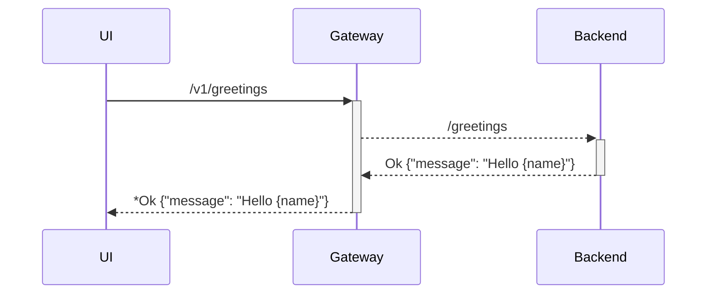

# Quarkus Messaging 

## Functional diagram v1 (no messaging)



## Development 

### Local

1. Test microprofile client implementation connection between the gateway and the client.

```
:terminal1
$ cd gateway 
$ mvn quarkus:dev 
:terminal2
$ cd backend
$ mvn quarkus:dev 
```

Request the backend : \
`curl -v http://localhost/v1/greeting?name=world`

